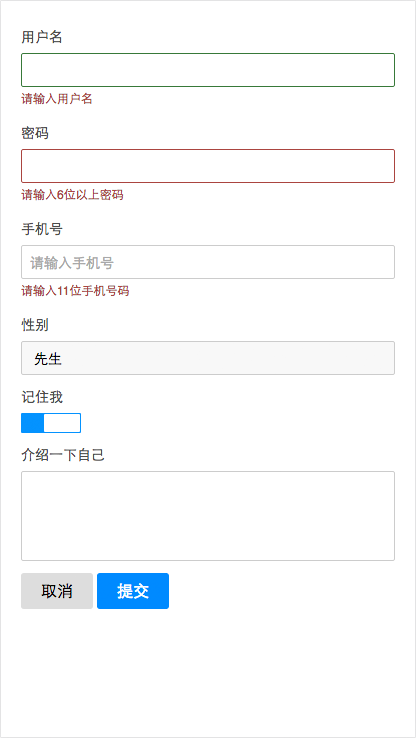

Formui
---
```jade
.lincoapp-formui
    .form
        .form-group
            span.form-title 用户名
            source(name="username")
            p.form-msg 请输入用户名
        .form-group
            span.form-title 密码
            source(name="password")
            p.form-msg 请输入6位以上密码
        .form-group
            span.form-title 手机号
            source(name="telphone")
            p.form-msg 请输入11位手机号码
        .form-group
            span.form-title 性别
            source(name="gender")
        .form-group
            span.form-title 记住我
            source(name="remember")
        .form-group
            span.form-title 介绍一下自己
            source(name="remark")

        .form-ctrl
            button.form-btn.btn-cancel 取消
            button.form-btn.skin-blue.btn-submit 提交

```
```js
var Form = require('form');
var form = new Form;
var gender = {
    "Male": "先生",
    "Female": "女士",
    "default": "Male"
}

form.load('input').attr({name: 'username'})
form.load('input').attr({name: 'password', type: 'password'})
form.load('input').attr({name: 'telphone', type: 'number', placeholder: '请输入手机号'})
form.load('select').attr({name: 'gender'}).render(gender)
form.load('slide').attr({name: 'remember'}).config({selected: true}).action()
form.load('textarea').attr({name: 'remark'})

// Form控件渲染到.form
form.render(this.find('.form'))

// Success
form.map.username.$.addClass('success')
form.map.password.$.addClass('error')

// 获取form数据
this.find('.form').delegate('.btn-submit', 'click', () => {
    console.log(form.getData())
})
```

